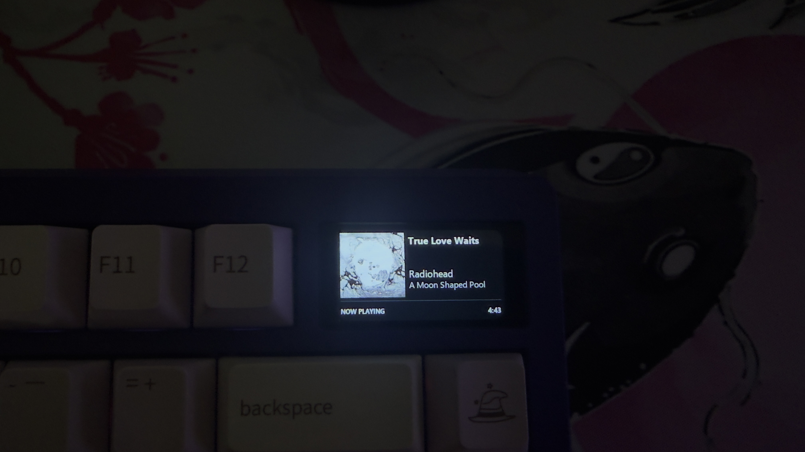
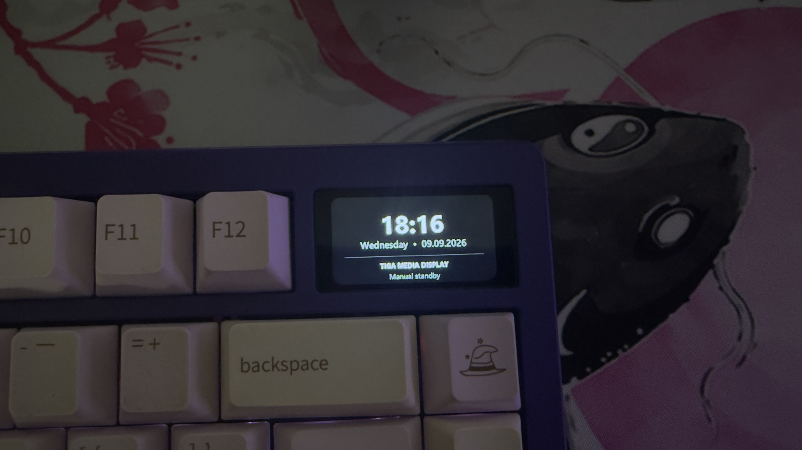
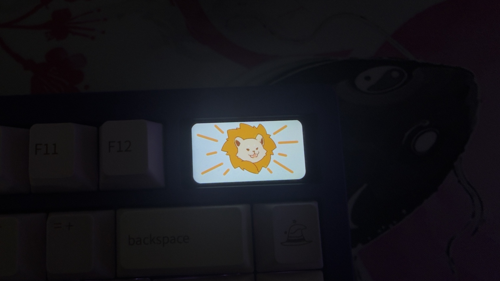

# TIGA Windows Media Display

Turn the **Meletrix Zoom75 TIGA** LCD into a Windows-wide **Now Playing** display.

This project reads the active Windows media session, renders artwork and metadata
for the TIGA's 320×172 screen, and uploads the result over a reverse-engineered
BLE media-transfer path.

> **Unofficial community project.** This project is not affiliated with or
> endorsed by Meletrix / Wuque Studio.

## Preview

### Now Playing

Displays artwork, title, artist, album, and total media duration from the active Windows media session.



### Standby

When no fresh media is playing, the display switches to a large clock/date standby screen.



### Intermission / stock animation

The TIGA may briefly show its built-in animation while a new custom image is being committed.



## What it does

- Uses Windows **Global System Media Transport Controls (GSMTC)** rather than a
  Spotify-specific API.
- Displays album/video artwork, title, artist/creator, album and static total
  duration when the media source exposes it.
- Works with Spotify and other Windows media-session sources.
- Uses a large clock/date standby screen when no fresh media is playing.
- Ignores stale remembered media at login until playback is proven fresh.
- Returns to standby after playback has been stopped/paused for 60 seconds.
- Uploads a full frame using keyboard flow-control; on the original development
  unit this typically takes about **8 seconds**.
- Includes a small Windows display-control utility for manual standby/black/auto
  modes and safe shutdown behavior.
- Starts automatically at user logon through a Scheduled Task.

## Current status

The project is functional on the original Windows development system and Zoom75
TIGA unit. This is still early community software, so additional hardware/firmware
coverage is very welcome.

### Known behavior / limitations

- Firefox + YouTube may expose title/thumbnail but no useful media duration.
- The TIGA may briefly show its stock roar/tiger animation while a new custom
  image upload is being committed. This is expected.
- If a BLE upload is interrupted halfway through, fully power-cycle the keyboard
  before attempting another media upload.
- The current renderer keeps the historical filename
  `tiga_windows_nowplaying_v2.py` for compatibility with the startup stack.

## Requirements

- Windows 10 or Windows 11
- Meletrix Zoom75 TIGA
- Bluetooth enabled; keyboard visible as `Zoom75 Tiga`
- Visual Studio 2022 C++ Build Tools / **Developer PowerShell for VS 2022**
- Rust + Cargo
- Python with the `py.exe` launcher
- Pillow (the build script can install it from `requirements.txt`)

The project does **not** require the blocked/vulnerable `meletrixid.sys` kernel
 driver.

## Quick start

Clone or download the repository, open **Developer PowerShell for VS 2022** in
its root, then run:

```powershell
powershell.exe -NoProfile -ExecutionPolicy Bypass -File .\BUILD_AND_INSTALL.ps1
```

Start the complete stack:

```powershell
.\START_STACK.ps1
```

Stop the complete stack:

```powershell
.\STOP_STACK.ps1
```

Check task/process status:

```powershell
.\STATUS_STACK.ps1
```

After installation the stack can also be started with:

```powershell
Start-ScheduledTask -TaskName "TIGA Windows Media Display"
```

## Architecture

```text
Windows media session (GSMTC)
        │
        ▼
tiga_windows_media_snapshot.exe
        │
        ▼
tiga_windows_nowplaying_v2.py
        │
        ├── artwork / title / artist / album / duration
        ├── standby clock + date
        │
        ▼
extracted/session_01_bulk_stream.bin
        │
        ▼
tiga_stream_watch_flow.exe
        │
        ├── BLE bulk upload
        ├── 4096-byte progress flow-control
        │
        ▼
Zoom75 TIGA LCD
```

More detail is in [`docs/ARCHITECTURE.md`](docs/ARCHITECTURE.md) and
[`docs/PROTOCOL_NOTES.md`](docs/PROTOCOL_NOTES.md).

## Manual BLE test

From `windows_ble_probe` after building:

```powershell
.\target\release\tiga_stream_watch_flow.exe --stream "..\extracted\session_01_bulk_stream.bin" --intra-block-ms 0 --confirm-flow-watch
```

The uploader intentionally remains active in watch mode after a successful
upload.

## Repository layout

```text
.
├── BUILD_AND_INSTALL.ps1
├── START_STACK.ps1
├── STOP_STACK.ps1
├── STATUS_STACK.ps1
├── install_tiga_startup.ps1
├── tiga_startup_supervisor.ps1
├── tiga_windows_nowplaying_v2.py
├── tiga_windows_media_snapshot.cpp
├── tiga_display_control.cpp
├── windows_ble_probe/
├── extracted/
├── docs/
└── reference/
```

`reference/` contains reverse-engineering probes and supporting material. Large
raw packet captures and personal runtime logs are intentionally not included.

## Privacy

The active implementation reads the local Windows media session. It does not
require a Spotify developer account, Spotify OAuth token, or cloud service for
Now Playing metadata.

Runtime logs stay local under `logs/` and are ignored by Git.

## Contributing

Issues and pull requests are welcome. See [`CONTRIBUTING.md`](CONTRIBUTING.md).

Useful areas include:

- testing on additional TIGA firmware revisions
- improving browser/media-session compatibility
- packaging a normal one-click Windows installer
- reducing upload latency further without overrunning keyboard flow-control
- UI/layout improvements

## Reverse-engineering notes

The BLE uploader uses progress notifications from the keyboard as flow-control
instead of blindly pacing writes. Protocol details, frame layout, checksums and
captured command structures are documented in
[`docs/PROTOCOL_NOTES.md`](docs/PROTOCOL_NOTES.md).

## License

TIGA Windows Media Display is released under the **MIT License**. See
[`LICENSE`](LICENSE).

Some reference material has its own copyright/license. See
[`THIRD_PARTY_NOTICES.md`](THIRD_PARTY_NOTICES.md).
